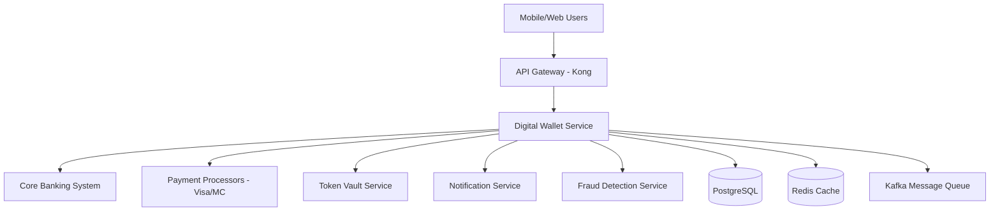
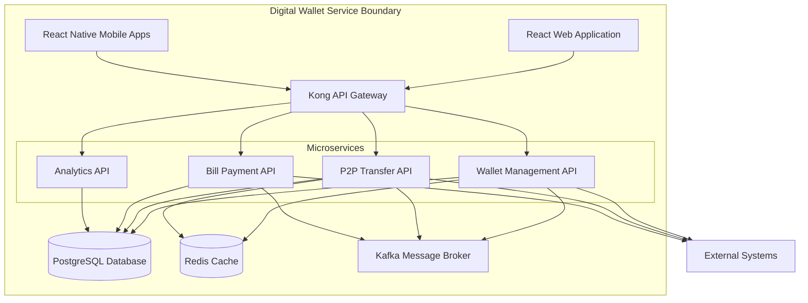
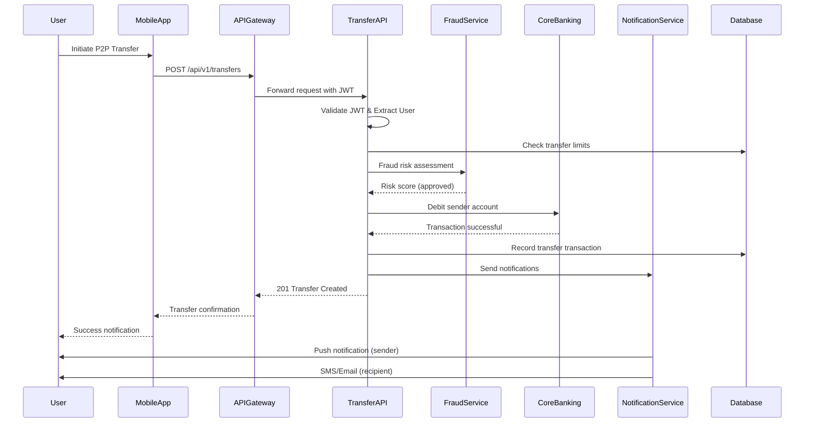
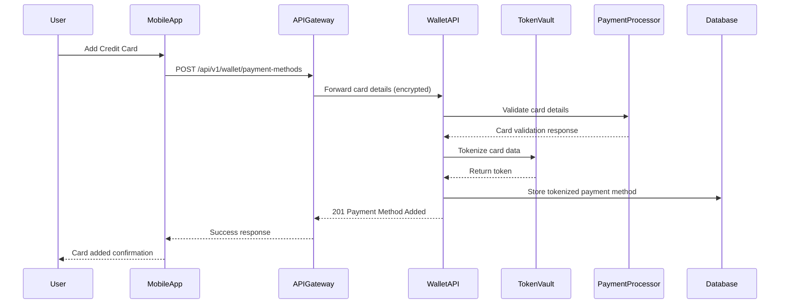

# Low-Level Design: Digital Wallet Service

**Document Information**

| Field | Value |
| :--- | :--- |
| **Service Name** | Digital Wallet Service |
| **Author(s)** | David Kim / Digital Banking Engineering Team |
| **Created Date** | 2024-01-15 |
| **Last Updated** | 2024-01-15 |
| **Version** | 1.0 |

---

## 1. Introduction

### 1.1. Purpose

This document provides the Low-Level Design (LLD) for the Digital Wallet Service. It details the component architecture, external interfaces, data management strategies, security mechanisms, deployment architecture, and operational considerations required to implement and operate the service.

### 1.2. Scope

The scope of this document covers the design of the Digital Wallet Service, which is responsible for:
- Exposing REST APIs for wallet management, P2P transfers, and bill payments
- Processing real-time payment transactions and notifications
- Managing secure storage of tokenized payment methods
- Integrating with core banking systems and external payment processors
- Providing transaction analytics and reporting capabilities

### 1.3. Glossary / Definitions

| Term | Definition |
| :--- | :--- |
| **Core Banking System** | IBM z/OS mainframe system managing customer accounts and balances |
| **Payment Tokenization** | Process of replacing sensitive payment data with non-sensitive tokens |
| **PCI DSS** | Payment Card Industry Data Security Standard |
| **KYC** | Know Your Customer - identity verification process |
| **AML** | Anti-Money Laundering compliance requirements |

---

## 2. Solution Overview

### 2.1. High-Level Design

The Digital Wallet Service is a Spring Boot microservices application that provides secure digital wallet functionality for retail banking customers. It integrates with existing core banking infrastructure while providing modern API-first architecture for mobile and web applications.

### 2.2. System Context Diagram (C4C)



---

## 3. Component Design

### 3.1. Container Diagram (C4C)



### 3.2. Component Diagram (C4C)

```mermaid
graph TB
    subgraph "Wallet Management API"
        WalletController[Wallet Controller]
        PaymentMethodController[Payment Method Controller]
        WalletService[Wallet Service]
        PaymentMethodService[Payment Method Service]
        TokenizationService[Tokenization Service]
        WalletRepository[Wallet Repository]
        PaymentMethodRepository[Payment Method Repository]
    end
    
    subgraph "P2P Transfer API"
        TransferController[Transfer Controller]
        TransferService[Transfer Service]
        TransferValidationService[Transfer Validation Service]
        TransferRepository[Transfer Repository]
        LimitService[Limit Service]
    end
    
    subgraph "Bill Payment API"
        BillPayController[Bill Pay Controller]
        BillPayService[Bill Pay Service]
        BillerService[Biller Service]
        SchedulingService[Scheduling Service]
        BillPayRepository[Bill Pay Repository]
    end
    
    subgraph "Shared Components"
        SecurityService[Security Service]
        AuditService[Audit Service]
        NotificationClient[Notification Client]
        CoreBankingClient[Core Banking Client]
        PaymentProcessorClient[Payment Processor Client]
    end
    
    WalletController --> WalletService
    PaymentMethodController --> PaymentMethodService
    WalletService --> TokenizationService
    WalletService --> WalletRepository
    PaymentMethodService --> PaymentMethodRepository
    
    TransferController --> TransferService
    TransferService --> TransferValidationService
    TransferService --> TransferRepository
    TransferService --> LimitService
    
    BillPayController --> BillPayService
    BillPayService --> BillerService
    BillPayService --> SchedulingService
    BillPayService --> BillPayRepository
    
    WalletService --> SecurityService
    TransferService --> SecurityService
    BillPayService --> SecurityService
    
    WalletService --> AuditService
    TransferService --> AuditService
    BillPayService --> AuditService
    
    TransferService --> NotificationClient
    BillPayService --> NotificationClient
    
    WalletService --> CoreBankingClient
    TransferService --> CoreBankingClient
    BillPayService --> CoreBankingClient
    
    PaymentMethodService --> PaymentProcessorClient
    TransferService --> PaymentProcessorClient
```



### 3.3. Key Workflows & Sequence Diagrams

#### P2P Money Transfer Flow



#### Payment Method Addition Flow



---

## 4. External Interfaces

This section details all external systems this service interacts with.

| Interface Name | System | Protocol | Security Mechanism | Purpose |
| :--- | :--- | :--- | :--- | :--- |
| **Core Banking API** | IBM z/OS Mainframe | REST over HTTPS | mTLS + JWT | Account balance checks, transaction processing, customer validation |
| **Payment Processor API** | Visa/Mastercard Networks | REST over HTTPS | API Keys + mTLS | Card validation, transaction authorization, settlement |
| **Token Vault API** | Internal Token Vault | REST over HTTPS | JWT + API Keys | Payment method tokenization and detokenization |
| **Fraud Detection API** | Third-party Fraud Service | REST over HTTPS | API Keys + IP Whitelisting | Real-time fraud scoring and risk assessment |
| **Notification Service API** | Internal Notification Service | REST over HTTPS | JWT | Push notifications, SMS, email delivery |
| **Identity Service API** | Auth0 | REST over HTTPS | OAuth 2.0 + JWT | User authentication and authorization |
| **Database** | PostgreSQL 14 | JDBC over TCP | Username/Password + SSL | Primary data persistence |
| **Cache** | Redis 7 | Redis Protocol | Password + TLS | Session storage and caching |
| **Message Broker** | Apache Kafka | Kafka Protocol | SASL/SCRAM + SSL | Asynchronous event processing |

---

## 5. Non-Functional Requirements (NFRs)

### 5.1. Performance & Scalability

#### API Metrics
| Endpoint | Method | Avg TPS | Peak TPS | Daily Volume | Latency (99p) |
| :--- | :--- | :--- | :--- | :--- | :--- |
| `/api/v1/wallet` | GET | 500 | 1,200 | 1.2M | 150ms |
| `/api/v1/transfers` | POST | 200 | 800 | 480K | 200ms |
| `/api/v1/wallet/payment-methods` | POST | 50 | 150 | 120K | 300ms |
| `/api/v1/bills/payments` | POST | 100 | 300 | 240K | 250ms |
| `/api/v1/transactions/history` | GET | 300 | 600 | 720K | 100ms |

#### Messaging Metrics
| Topic Name | Direction | Avg Msgs/Sec | Peak Msgs/Sec | Max Msg Size | Latency (99p) |
| :--- | :--- | :--- | :--- | :--- | :--- |
| `wallet.transactions` | Produce | 300 | 1,000 | 2KB | N/A |
| `wallet.notifications` | Produce | 400 | 1,200 | 1KB | N/A |
| `fraud.alerts` | Consume | 50 | 200 | 5KB | 100ms |
| `core-banking.events` | Consume | 100 | 400 | 3KB | 200ms |

#### Database Volumetrics
| Metric | Value |
| :--- | :--- |
| **Initial Data Size** | 50 GB |
| **Data Growth Rate** | 15 GB/month |
| **Read/Write Ratio** | 70% Read / 30% Write |
| **Query Performance** | Critical queries must execute in < 50ms |
| **Connection Pool Size** | 20 connections per service instance |

#### Background Job Metrics
| Job Name | Frequency | Expected Runtime | Data Processed |
| :--- | :--- | :--- | :--- |
| **Transaction Reconciliation** | Nightly at 2 AM | 45 minutes | 500K transactions |
| **Payment Method Validation** | Daily at 6 AM | 15 minutes | 100K payment methods |
| **Analytics Data Aggregation** | Hourly | 5 minutes | 50K transactions |
| **Expired Token Cleanup** | Weekly | 10 minutes | 10K expired tokens |

### 5.2. Availability
- The service must have an availability of **99.9%** (8.77 hours downtime per year)
- RTO (Recovery Time Objective): 15 minutes
- RPO (Recovery Point Objective): 5 minutes
- Disaster recovery across multiple AWS availability zones

---

## 6. Data Management

### 6.1. Database Design
- **Schema:** Database schema is defined using Flyway migration scripts in `/src/main/resources/db/migration/`
- **ORM:** Spring Data JPA with Hibernate for object-relational mapping
- **Migrations:** Flyway for versioned database schema management
- **Connection Pooling:** HikariCP with 20 connections per service instance
- **Database Monitoring:** pg_stat_statements for query performance monitoring

#### Core Tables
```sql
-- Wallets table
CREATE TABLE wallets (
    id UUID PRIMARY KEY,
    customer_id VARCHAR(50) NOT NULL UNIQUE,
    status VARCHAR(20) NOT NULL DEFAULT 'ACTIVE',
    created_at TIMESTAMP NOT NULL DEFAULT CURRENT_TIMESTAMP,
    updated_at TIMESTAMP NOT NULL DEFAULT CURRENT_TIMESTAMP
);

-- Payment Methods table
CREATE TABLE payment_methods (
    id UUID PRIMARY KEY,
    wallet_id UUID NOT NULL REFERENCES wallets(id),
    token VARCHAR(100) NOT NULL UNIQUE,
    type VARCHAR(20) NOT NULL, -- CREDIT_CARD, DEBIT_CARD, BANK_ACCOUNT
    masked_number VARCHAR(20) NOT NULL,
    expiry_month INTEGER,
    expiry_year INTEGER,
    is_default BOOLEAN DEFAULT FALSE,
    status VARCHAR(20) NOT NULL DEFAULT 'ACTIVE',
    created_at TIMESTAMP NOT NULL DEFAULT CURRENT_TIMESTAMP
);

-- Transactions table
CREATE TABLE transactions (
    id UUID PRIMARY KEY,
    wallet_id UUID NOT NULL REFERENCES wallets(id),
    type VARCHAR(30) NOT NULL, -- P2P_TRANSFER, BILL_PAYMENT, etc.
    amount DECIMAL(15,2) NOT NULL,
    currency VARCHAR(3) NOT NULL DEFAULT 'USD',
    status VARCHAR(20) NOT NULL,
    description TEXT,
    recipient_identifier VARCHAR(100),
    payment_method_id UUID REFERENCES payment_methods(id),
    external_transaction_id VARCHAR(100),
    created_at TIMESTAMP NOT NULL DEFAULT CURRENT_TIMESTAMP,
    completed_at TIMESTAMP
);
```

### 6.2. Message Broker Design

#### Topic: `wallet.transactions`
- **Direction**: Produce
- **Purpose**: Publish transaction events for downstream processing (analytics, notifications)
- **Message Schema**:
```json
{
  "transactionId": "uuid",
  "walletId": "uuid",
  "type": "P2P_TRANSFER|BILL_PAYMENT",
  "amount": "decimal",
  "currency": "string",
  "status": "COMPLETED|FAILED",
  "timestamp": "iso8601",
  "metadata": {}
}
```
- **Delivery Semantics**: At-least-once with idempotency keys
- **Partitioning**: By wallet_id for ordered processing per customer

#### Topic: `wallet.notifications`
- **Direction**: Produce
- **Purpose**: Trigger customer notifications for transaction events
- **Consumer Group ID**: `notification-service-group`
- **Message Schema**:
```json
{
  "customerId": "string",
  "notificationType": "TRANSACTION_COMPLETE|PAYMENT_FAILED",
  "channels": ["PUSH", "SMS", "EMAIL"],
  "templateData": {},
  "priority": "HIGH|MEDIUM|LOW"
}
```

#### Topic: `fraud.alerts`
- **Direction**: Consume
- **Consumer Group ID**: `wallet-fraud-group`
- **Purpose**: Receive fraud alerts to block suspicious transactions
- **Concurrency**: 3 concurrent listeners
- **Poison Message Handling**: After 3 retries, move to `fraud.alerts.dlq`

### 6.3. Caching Strategy
- **Redis Cluster**: 3-node cluster with replication
- **Cache Patterns**:
  - **Wallet Data**: Cache for 15 minutes, invalidate on updates
  - **Payment Methods**: Cache for 30 minutes, invalidate on changes
  - **Transaction Limits**: Cache for 1 hour, refresh on limit changes
  - **Session Data**: Store for 24 hours with sliding expiration

### 6.4. Records Management & Retention
- **Retention Policy:**
  - Transaction data retained in primary database for 2 years
  - Sensitive payment data retained for 7 years per PCI DSS requirements
  - Audit logs retained for 10 years per regulatory requirements
- **Archival Strategy:**
  - After 2 years, transaction data archived to AWS S3 Glacier
  - Nightly job processes archival with data validation
  - Archived data accessible via separate query service
- **Data Purging:**
  - Soft delete approach with status flags
  - Hard delete only after regulatory retention periods
  - Automated purging jobs with approval workflows

---

## 7. Security Design

### 7.1. Authentication & Authorization
- **Customer Authentication:** OAuth 2.0 with Auth0, JWT tokens with 1-hour expiration
- **Service-to-Service:** mTLS certificates for internal service communication
- **API Security:** Rate limiting (100 requests/minute per user), request signing for sensitive operations
- **Multi-Factor Authentication:** Required for high-value transactions (>$1,000)

### 7.2. Data Protection
- **Encryption at Rest:** AES-256 encryption for all sensitive data in PostgreSQL
- **Encryption in Transit:** TLS 1.3 for all external communications, mTLS for internal services
- **Payment Data Security:** PCI DSS Level 1 compliance with tokenization
- **Key Management:** AWS KMS for encryption key management with automatic rotation

### 7.3. Security Controls
- **Input Validation:** Comprehensive validation using Bean Validation (JSR-303)
- **SQL Injection Prevention:** Parameterized queries with JPA/Hibernate
- **XSS Prevention:** Content Security Policy headers, input sanitization
- **CSRF Protection:** CSRF tokens for state-changing operations

### 7.4. Secret Management
- **Secret Storage:** AWS Secrets Manager for database credentials, API keys
- **Secret Rotation:** Automatic rotation every 90 days
- **Access Control:** IAM roles with least privilege principle
- **Audit:** All secret access logged and monitored

---

## 8. Deployment Architecture

### 8.1. Infrastructure Requirements
- **Container Platform:** Amazon EKS (Kubernetes) with 3 availability zones
- **Compute:** 
  - Production: 6 instances (t3.large - 2 vCPU, 8GB RAM each)
  - Staging: 3 instances (t3.medium - 2 vCPU, 4GB RAM each)
- **Auto Scaling:** Horizontal Pod Autoscaler (2-10 pods based on CPU/memory)
- **Load Balancing:** Application Load Balancer with health checks

### 8.2. Database Infrastructure
- **Primary Database:** Amazon RDS PostgreSQL 14 (db.r5.xlarge)
- **Read Replicas:** 2 read replicas for analytics and reporting queries
- **Backup Strategy:** Automated daily backups with 30-day retention
- **High Availability:** Multi-AZ deployment with automatic failover

### 8.3. Health Checks
- **Kubernetes Liveness Probe:** `/actuator/health/liveness` every 30 seconds
- **Kubernetes Readiness Probe:** `/actuator/health/readiness` every 10 seconds
- **Health Check Dependencies:** Database, Redis, Kafka connectivity
- **Load Balancer Health Check:** `/actuator/health` every 15 seconds

### 8.4. JVM Configuration
- **Garbage Collector:** G1GC for low-latency requirements
- **Heap Settings:** `-Xms2g -Xmx6g` (leaving 2GB for OS and non-heap)
- **GC Tuning:** `-XX:MaxGCPauseMillis=200 -XX:G1HeapRegionSize=16m`
- **JVM Monitoring:** JFR (Java Flight Recorder) enabled for performance analysis

---

## 9. Observability

### 9.1. Logging
- **Framework:** SLF4J with Logback, structured JSON logging
- **Log Aggregation:** AWS CloudWatch Logs with log groups per service
- **Correlation:** Unique correlation ID (X-Correlation-ID) for request tracing
- **Log Levels:** INFO for business events, DEBUG for troubleshooting (configurable)
- **Sensitive Data:** PII and payment data masked in logs

### 9.2. Metrics (Monitoring)
- **Metrics Platform:** Micrometer with Prometheus and Grafana
- **Business Metrics:**
  - Transaction success/failure rates
  - Average transaction amounts
  - Customer wallet adoption rates
  - Payment method usage distribution
- **Technical Metrics:**
  - API response times (p50, p95, p99)
  - Database connection pool usage
  - JVM metrics (heap, GC, threads)
  - Kafka consumer lag
- **Alerting:** PagerDuty integration for critical alerts

### 9.3. Tracing
- **Distributed Tracing:** OpenTelemetry with AWS X-Ray
- **Trace Sampling:** 10% sampling rate in production, 100% in staging
- **Trace Context:** Propagated across all service calls and async operations
- **Performance Analysis:** Trace analysis for slow transactions and bottlenecks

### 9.4. Application Performance Monitoring
- **APM Tool:** New Relic for application performance monitoring
- **Real User Monitoring:** Frontend performance tracking
- **Synthetic Monitoring:** Automated transaction testing every 5 minutes
- **Error Tracking:** Automatic error detection and alerting

---

## 10. Operational Acceptance Testing (OAT) & Resiliency

### 10.1. Failure Scenarios & Recovery

#### Database Outage
- **Impact:** Service loses read/write capability
- **Detection:** Health checks fail within 30 seconds
- **Recovery:** Automatic failover to standby database (RTO: 2 minutes)
- **Graceful Degradation:** Return cached data where possible, queue writes

#### Core Banking System Outage
- **Impact:** Cannot process transactions or validate balances
- **Detection:** Circuit breaker opens after 5 consecutive failures
- **Recovery:** Exponential backoff retry (max 5 minutes)
- **Graceful Degradation:** Return 503 Service Unavailable with retry-after header

#### Payment Processor Outage
- **Impact:** Cannot validate payment methods or process card transactions
- **Detection:** Health check failures and increased error rates
- **Recovery:** Failover to secondary payment processor
- **Graceful Degradation:** Queue transactions for later processing

#### Kafka Outage
- **Impact:** Event publishing fails, notifications delayed
- **Detection:** Producer send failures and consumer lag alerts
- **Recovery:** Automatic reconnection with exponential backoff
- **Graceful Degradation:** Store events in database for later replay

### 10.2. Retry Mechanisms
- **API Calls:** Spring Retry with exponential backoff (3 attempts, max 30 seconds)
- **Database Operations:** Connection pool retry with circuit breaker
- **Message Publishing:** Kafka producer retry with idempotency keys
- **External Service Calls:** Resilience4j circuit breaker with fallback

### 10.3. Circuit Breaker Configuration
```yaml
resilience4j:
  circuitbreaker:
    instances:
      corebanking:
        failure-rate-threshold: 50
        wait-duration-in-open-state: 30s
        sliding-window-size: 10
        minimum-number-of-calls: 5
      paymentprocessor:
        failure-rate-threshold: 60
        wait-duration-in-open-state: 60s
        sliding-window-size: 20
```

### 10.4. Chaos Engineering
- **Tool:** Chaos Monkey for Kubernetes
- **Scenarios:**
  - Random pod termination during business hours
  - Network latency injection to database connections
  - Memory pressure simulation
  - Kafka partition leader election simulation
- **Schedule:** Weekly chaos experiments in staging, monthly in production
- **Monitoring:** All chaos experiments monitored with automatic rollback

---

## 11. API Specifications

### 11.1. Wallet Management APIs

#### Get Wallet Details
```http
GET /api/v1/wallet
Authorization: Bearer {jwt_token}
```

**Response:**
```json
{
  "walletId": "uuid",
  "customerId": "string",
  "status": "ACTIVE",
  "paymentMethods": [
    {
      "id": "uuid",
      "type": "CREDIT_CARD",
      "maskedNumber": "**** **** **** 1234",
      "expiryMonth": 12,
      "expiryYear": 2025,
      "isDefault": true,
      "status": "ACTIVE"
    }
  ],
  "createdAt": "2024-01-15T10:30:00Z"
}
```

#### Add Payment Method
```http
POST /api/v1/wallet/payment-methods
Authorization: Bearer {jwt_token}
Content-Type: application/json

{
  "type": "CREDIT_CARD",
  "cardNumber": "4111111111111111",
  "expiryMonth": 12,
  "expiryYear": 2025,
  "cvv": "123",
  "holderName": "John Doe"
}
```

### 11.2. P2P Transfer APIs

#### Create Transfer
```http
POST /api/v1/transfers
Authorization: Bearer {jwt_token}
Content-Type: application/json

{
  "recipientIdentifier": "john.doe@email.com",
  "amount": 100.00,
  "currency": "USD",
  "description": "Lunch money",
  "paymentMethodId": "uuid"
}
```

**Response:**
```json
{
  "transferId": "uuid",
  "status": "COMPLETED",
  "amount": 100.00,
  "currency": "USD",
  "recipientIdentifier": "john.doe@email.com",
  "description": "Lunch money",
  "createdAt": "2024-01-15T10:30:00Z",
  "completedAt": "2024-01-15T10:30:05Z"
}
```

### 11.3. Bill Payment APIs

#### Get Billers
```http
GET /api/v1/bills/billers?search=electric
Authorization: Bearer {jwt_token}
```

#### Schedule Bill Payment
```http
POST /api/v1/bills/payments
Authorization: Bearer {jwt_token}
Content-Type: application/json

{
  "billerId": "uuid",
  "accountNumber": "123456789",
  "amount": 150.00,
  "paymentDate": "2024-02-01",
  "isRecurring": true,
  "frequency": "MONTHLY"
}
```

---

## 12. Testing Strategy

### 12.1. Unit Testing
- **Framework:** JUnit 5 with Mockito for mocking
- **Coverage Target:** 90% code coverage for service layer, 80% overall
- **Test Categories:**
  - Service layer business logic
  - Repository layer data access
  - Utility classes and validators
  - Security components

### 12.2. Integration Testing
- **Framework:** Spring Boot Test with TestContainers
- **Database Testing:** TestContainers PostgreSQL for isolated database tests
- **Message Testing:** TestContainers Kafka for messaging integration tests
- **API Testing:** MockMvc for controller integration tests

### 12.3. Contract Testing
- **Framework:** Pactflow for consumer-driven contract testing
- **Provider Tests:** Verify API contracts with downstream consumers
- **Consumer Tests:** Verify integration with upstream services
- **Contract Evolution:** Backward compatibility validation

### 12.4. End-to-End Testing
- **Framework:** Karate for API acceptance testing
- **Test Scenarios:**
  - Complete user registration and wallet setup
  - P2P transfer with notifications
  - Bill payment scheduling and execution
  - Error handling and recovery scenarios

### 12.5. Performance Testing
- **Tool:** JMeter for load and stress testing
- **Test Scenarios:**
  - Normal load: 500 TPS for 30 minutes
  - Peak load: 1,200 TPS for 10 minutes
  - Stress test: Gradual increase to failure point
  - Endurance test: Normal load for 4 hours

### 12.6. Security Testing
- **Static Analysis:** SonarQube for code security scanning
- **Dependency Scanning:** OWASP Dependency Check
- **Penetration Testing:** Third-party security assessment
- **Vulnerability Scanning:** Regular automated security scans

---

## 13. Appendix

### 13.1. Open Issues
- Core banking system API response time SLA needs confirmation (target: <500ms)
- Payment processor failover mechanism requires additional testing
- Kafka topic retention policies need alignment with compliance requirements
- Mobile app push notification delivery guarantees need clarification

### 13.2. References
- [Digital Wallet Requirements Document](digital-wallet-requirements.md)
- [PCI DSS Compliance Guidelines](https://www.pcisecuritystandards.org/)
- [Spring Boot Best Practices](https://spring.io/guides)
- [AWS Well-Architected Framework](https://aws.amazon.com/architecture/well-architected/)
- [Microservices Patterns](https://microservices.io/patterns/)

### 13.3. Architecture Decision Records (ADRs)

#### ADR-001: Database Choice - PostgreSQL
- **Decision:** Use PostgreSQL as primary database
- **Rationale:** ACID compliance, JSON support, strong consistency, mature ecosystem
- **Alternatives Considered:** MongoDB (eventual consistency concerns), MySQL (limited JSON support)

#### ADR-002: Message Broker - Apache Kafka
- **Decision:** Use Apache Kafka for event streaming
- **Rationale:** High throughput, durability, exactly-once semantics, strong ecosystem
- **Alternatives Considered:** RabbitMQ (lower throughput), AWS SQS (vendor lock-in)

#### ADR-003: Caching Strategy - Redis
- **Decision:** Use Redis for distributed caching
- **Rationale:** High performance, data structure support, clustering capabilities
- **Alternatives Considered:** Hazelcast (Java-specific), Memcached (limited data types)